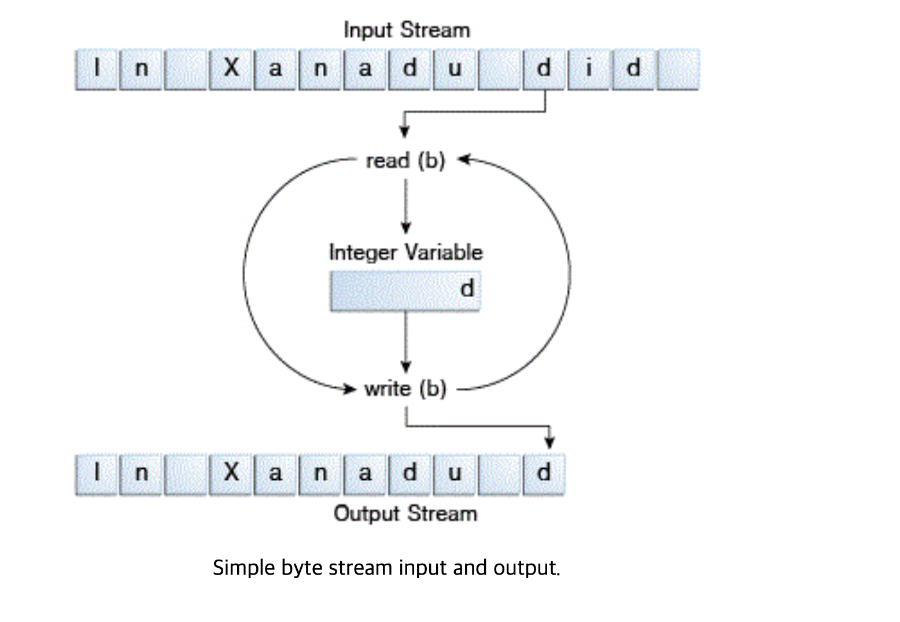

# Basic I/O

https://docs.oracle.com/javase/tutorial/essential/io/streams.html

## I/O Streams

Stream 은 input source 와 output destination 으로 표현할 수 있다. 
- 예시로는 disk files, devices, other programs, memory arrays 가 있다. 

Stream 은 다양한 데이터 타입을 지원한다. 
- bytes, primitive data type, localized characters, object 등. 
- 어떤 stream 들은 데이터 변환에 유용한 타입만 지원하기도 한다.

Stream 은 데이터들의 연속 (sequence) 이다.

## Byte Streams

Program 은 8비트 바이트의 input, output stream 을 이용한다.

모든 ByteStream class 들은 `InputStream` 과 `OutputStream` 상속받는다. 

```java
import java.io.FileInputStream;
import java.io.FileOutputStream;
import java.io.IOException;

public class CopyBytes {
    public static void main(String[] args) throws IOException {

        FileInputStream in = null;
        FileOutputStream out = null;

        try {
            in = new FileInputStream("xanadu.txt");
            out = new FileOutputStream("outagain.txt");
            int c;

            while ((c = in.read()) != -1) {
                out.write(c);
            }
        } finally {
            if (in != null) {
                in.close();
            }
            if (out != null) {
                out.close();
            }
        }
    }
}
```

다음과 같은 코드가 있다고 가정했을 때 ByteStream 은 이렇게 읽는다. 



- byte 하나씩 읽고 하나씩 쓴다. 이걸 루프돌면서 하는 것.

### Always Close Streams

스트림을 사용했으면 항상 닫는게 중요하다. finally block 을 통해서 stream 을 항상 닫던가 해야함.

파일을 안닫으면 생기는 누수는 메모리에 있는 파일 내용, 파일 포인터, 여러 프로세스의 파일에 대한 접근을 가능하게 해주는 Lock 과 같은 것들이 있다. 

네트워크 통신에서 해당 스트림을 닫지 않으면은 소켓 누수가 생긴다.

### When Not to Use Byte Streams

위의 예제는 low-level I/O 를 사용한 예제임.

위의 예제인 `xanadu.txt` 는 아래와 같은 character 를 포함한 파일이기 때문에 CharacterStream 을 쓰는게 좋다. 

ByteStream 은 가장 원시적인 데이터 스트림이다. 

```text
In Xanadu did Kubla Khan
A stately pleasure-dome decree:
Where Alph, the sacred river, ran
Through caverns measureless to man
Down to a sunless sea.
```

## Character Streams

Java Platform 은 character 를 unicode convention 에 맞춰서 저장한다. 

character Stream 은 자동적으로 local character set 에 맞춰서 번역한다.
- 예로 Western locale 의 경우에는 8bit superset ASCII 코드이다.

I/O Character Stream 은 I/O Byte Stream 보다 복잡하지 않다.

Internationalization 이 목적이 아니라면 그냥 쓰면 되고, 그것도 중요하다면 해당 chatper 를 보자. [internationalization](https://docs.oracle.com/javase/tutorial/i18n/index.html)

### Using Character Streams

